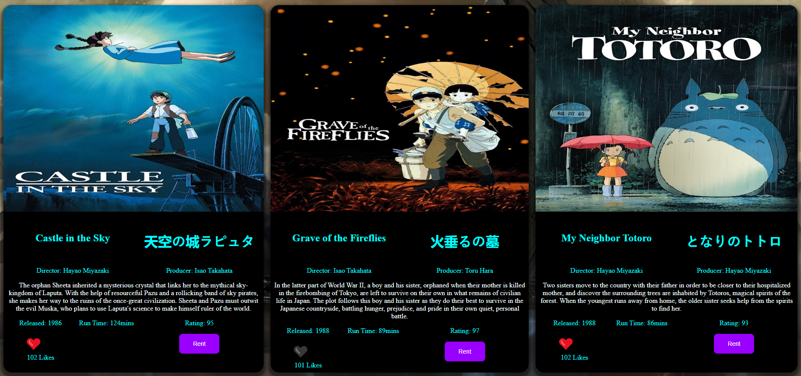
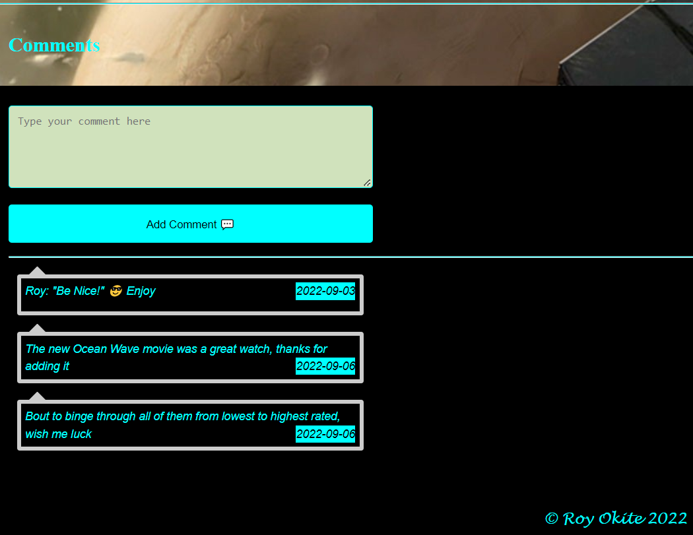
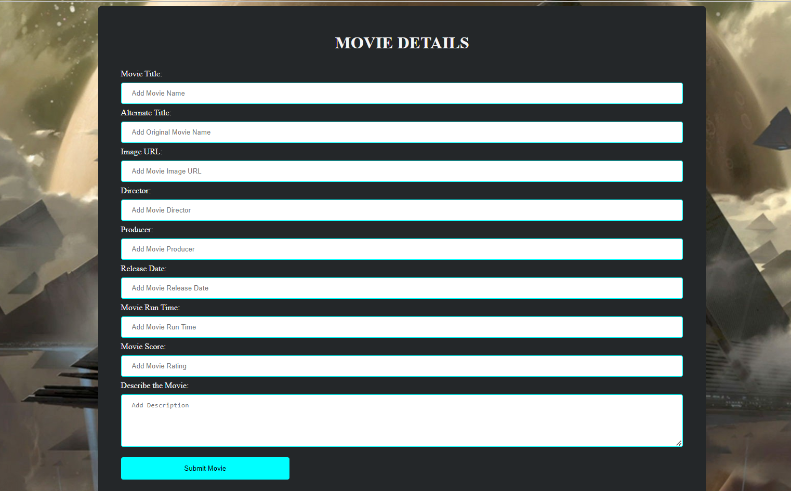
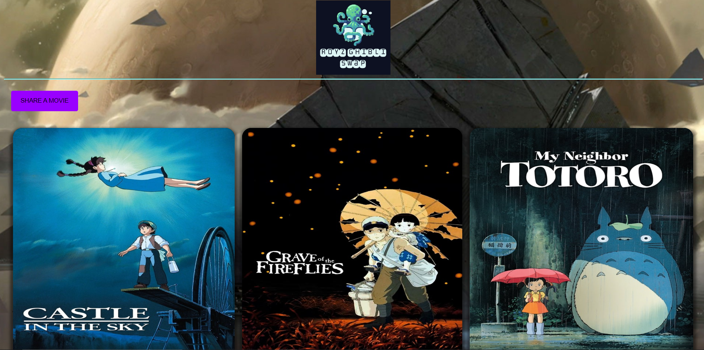

# ROYZ GHIBLI SWAP

## By: ROY OKITE

## Project Description

The project is a single web page that presents users with a variety of foreign animated films.
These have been rendered from a publicly available API `https://ghibliapi.herokuapp.com/films`

The user can scroll through the content where each film is displayed in a card and contains
relevant information regarding the film such as:

- Title
- Original title in the local language
- Image or poster
- Film director
- Film producer
- Release date
- Run time
- Score gotten from Rotten Tomatoes
- Film description



## Deliverables

The page utilizes HTML for structure, CSS for styling and JavaScript for interactivity.

A user is able to:

- Rent a movie by clicking the `RENT` button which adds it to the cart `+🛒`, a second click
  removes the item from the cart. Both interactions trigger a banner that confirms the action.
- Like a movie through the `❤️` button to add it to favourites, a second `🖤` click undoes this
  with banners as well for every action.
- CLick the `Add Comment 💬` button to add a comment at the bottom of the page. This presents
  the comment and date posted in the dialogue box.

  

- Add a new film by clicking the `SHARE A MOVIE` button which presents a form where the
  user inputs all the required details and then using the `Submit Movie` to add it to
  the list of available films below. A `HIDE FORM` button hides the form after use.
  All fields are required when submitting a new film for consistency.

  

## Setup Instructions

Besides the`https://ghibliapi.herokuapp.com/films` API, the project utilizes some local JSON servers to enable the user inputs
such as new films and comments to be persisted when the user interacts with the page.

`http://localhost:3000/animations` for newly added films.
`http://localhost:3000/comments` for posted comments.

The project has been pushed to a Github repository: `https://github.com/royokite/study-ghost`

### Closing

This project took a week of planning, design and development. Some modifications have been made
along the way to incorporate new functionality and optimize the code as well. Its development
will still continue to elevate the polishing done so far.

Sample code to render films on the page:

```
function renderProducts(movie) {

    let card = document.createElement('li');
    card.className = 'card'
    card.innerHTML = `
    
    <section class='card-content'>
        <article class='box1'><h2>${movie.title}</h2></article>
        <article class='box2'><h3>${movie.original_title}</h3></article>
        <article class='box3'>Director: ${movie.director}</article>
        <article class='box4'>Producer: ${movie.producer}</article>
        <article class='box5'><p>${movie.description}</p></article>
        <article class='box6'>Released: ${movie.release_date}</article>
        <article class='box7'>Run Time: ${movie.running_time}mins</article>
        <article class='box8'>Rating: ${movie.rt_score}</article>
        <button class='box9 button'>${notLiked}</button><p class='likes'>101<span> Likes</span></p>
        <button class='box11 button'>Rent</button>
    </section>
    `

    movieSpace.appendChild(card);
}
```



### Copyright

All the information and resources used have been freely and publicly available and a special
thanks goes to `Studio Ghibli` as details from their quality and critically acclaimed animated
films inspired the creation of this project.

All the code and resources utilized have been developed by myself.

[^1]: This project aims to fulfill requirements for the Moringa School phase 1 project.
